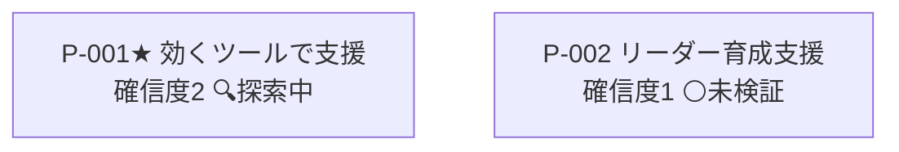

<!-- 生成物: gen_views.py list による機械生成。手編集禁止。`python3 tools/gen_views.py list` で再生成する。生成基準日: 2026-07-28（モード 探索） -->
<!-- ⚠️ 架空/シミュレーションデータを含む活動: [[SELF-LEARN-001]] [[SELF-LEARN-002]]。これら由来の確信度・判断は実データ未検証。 -->

# 目的仮説リスト（self）

★=核心目的（`core`）。関連列は ← 派生元（`derived-from`）／⟲ 書換（`revises`）／→ 因果先（`leads-to`）／⚡対抗（`counters`）／検証活動（ACT）。

## 目的の系譜

## 目的仮説

| ID | タイトル | 確信度 | ステータス | 関連 | 直近の根拠 |
|---|---|---|---|---|---|
| [[SELF-P-001]]★ | 効くツールでエンジニアの新領域挑戦を支援する | 2 | 🔍探索中 | [[SELF-ACT-001]] [[SELF-ACT-002]] [[SELF-ACT-003]] | 〈架空〉〈他者反応〉Mさん（打診1人目）は約1時間割いたが「使ってみたい」に至らず、育成… |
| [[SELF-P-002]] | 顧客の考えるテーマに真摯に向き合える次世代リーダーの育成を支援する | 1 | ⚪未検証 | — | 初期作成（勘・思いつき）。種の出所は打診1人目の想定外だが、自分の目的としての硬さは未検… |

## 次に外界で確かめるべき目的（確信度低 × 未検証/探索中。⚠️＝試行なし＝最優先）

- [[SELF-P-002]] 顧客の考えるテーマに真摯に向き合える次世代リーダーの育成を支援する（確信度1・未検証） ⚠️未着手（試行なし）
- [[SELF-P-001]] 効くツールでエンジニアの新領域挑戦を支援する（確信度2・探索中）

## ステータス別サマリ

| ステータス | 件数 |
|---|---|
| ⚪未検証 | 1 |
| 🔍探索中 | 1 |
| 🌱立ち上がりつつある | 0 |
| ✅立ち上がった | 0 |
| 🗄️棚上げ | 0 |
